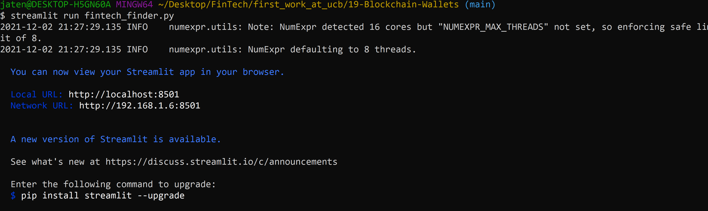
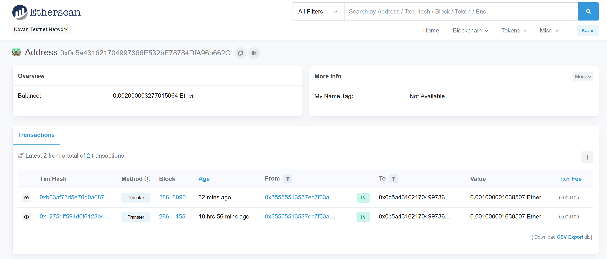
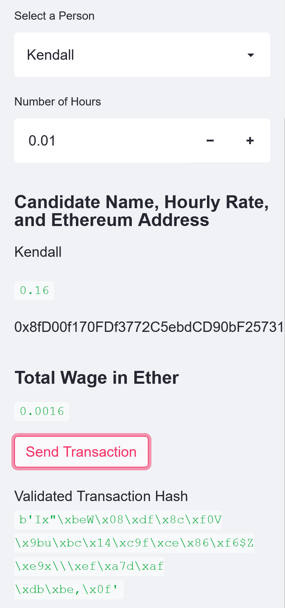
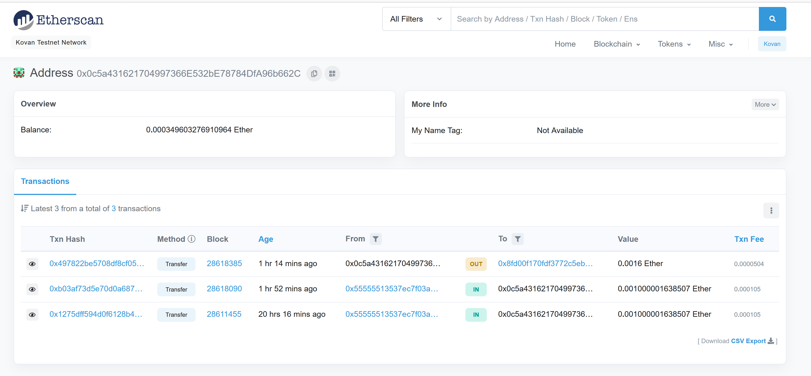
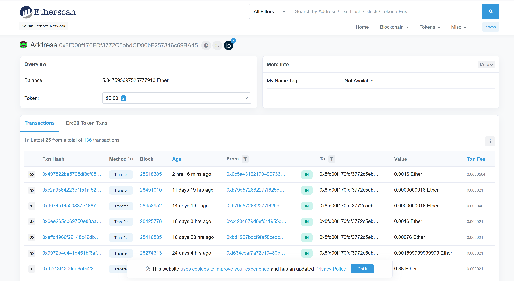

<div id="top"></div>
<br />

<h3 align="center">FinTech Finder</h3>

  <p align="center">
  FinTech finder allows you to transfer funds (ETH) from your wallet to hire a fintech professional of your choice. 
    <a href="https://github.com/jtengsico/18-Blockchain-With-Python.git">View Demo</a>
  </p>
</div>

<!-- TABLE OF CONTENTS -->
<details>
  <summary>Table of Contents</summary>
  <ol>
    <li><a href="#about-the-project">About The Project</a>
    <li><a href="#built-with">Built With</a></li>
    <li><a href="#installation">Installation</a></li>
    <li><a href="#transaction-data">Transaction Data</a></li>
    <li><a href="#license">License</a></li>
    <li><a href="#acknowledgments">Acknowledgments</a></li>
  </ol>
</details>

<!-- ABOUT THE PROJECT -->
## About The Project
This project allows you to make a wallet, add ETH, and pay a fintech professional through a streamlit app. 

<p align="right">(<a href="#top">back to top</a>)</p>

### Built With
*python 3.7 
*streamlit 0.84.2
*dotenv 
*bip44 
*web3 

<p align="right">(<a href="#top">back to top</a>)</p>

<!-- Installation -->
### Installation 

To setup this program on your desktop, please clone the repo.
Make sure you get some ETH from the KOVAN testnet before running this application.
You need ETH to hire the fintech professional.
After cloning the repo, follow the steps below.

1. Clone the repo
   ```sh
   git clone https://github.com/jtengsico/19-Blockchain-Wallets.git
   ```
2. Install required python packages listed in the Built With section. 
3. In your terminal, navigate to the folder that contains the fintech_finder.py file. 
4. Enter streamlit run fintech_finder.py and this will launch the streamlit app in your default browser. 
5. You should see the screen below.
 

<p align="right">(<a href="#top">back to top</a>)</p>

<!-- Transaction Data -->
## Transaction Data
1. First go to https://kovan.etherscan.io/ (Kovan Testnet) and look up your Ethereum address to see your transaction balance. 
 

2. On the streamlit app, select a professional and the amount of time you will hire them for. 
Next, validate that amount and you should see the screen below on the left hand side. 
 

3. Go back to etherscan and look up your Ethereum address again to see that funds have left your account. 


4. Go to the streamlit app and copy the address where the transaction was sent to. Go back to etherscan and check the balance of that account. 
You should see that there was a recent transaction for the fintech professional you hired. 


<p align="right">(<a href="#top">back to top</a>)</p>

<!-- LICENSE -->
## License

Distributed under the MIT License.
See [license txt](https://github.com/git/git-scm.com/blob/main/MIT-LICENSE.txt)

<p align="right">(<a href="#top">back to top</a>)</p>

<!-- ACKNOWLEDGMENTS -->
## Acknowledgments
Credit to creator of readme template. The repo also has useful resources. 
* [README Template](https://github.com/othneildrew/Best-README-Template.git)

<p align="right">(<a href="#top">back to top</a>)</p>
